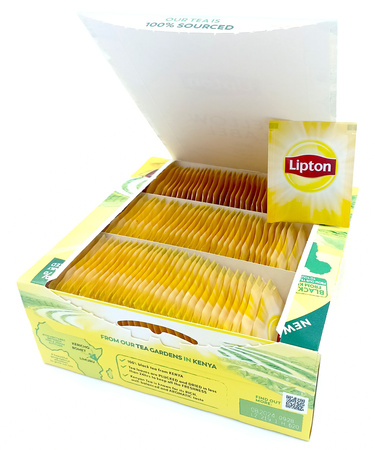
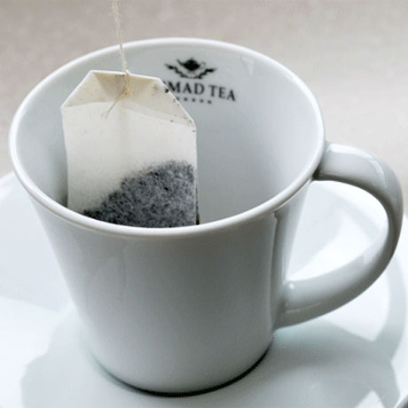
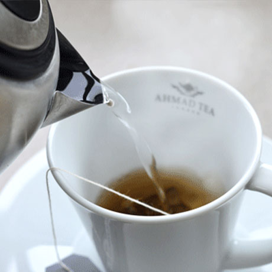

# PRZYKŁADOWY OPIS PRZYGOTOWANIA HERBATY

# Lipton

## Informacje:
Jest to najbardziej podstawowa herbata, jaką można przygotować. Bardzo często jest podawana w formie torebki, gotowej do zalania.

- Wymagana temperatura wody: 100 stopni
- Wymagane przyrządy: Filiżanka lub kubek

## Sposób przygotowania
1. Zagotuj wodę do 100 stopni celsiusza
2. Jeżeli herbata jest w pudełku, oraz jest jeszcze w saszetce, wyciągnij ją z szasetki, tak, aby mieć samą torebkę.
2. Przygotuj czystą filiżankę i włóż torebkę do filiżanki lub kubka tak jak poniżej

4. Zalej wrzącą wodą herbatę. Upewnij się, żeby trzymać papierową końcówke torebki (ogonek, jeżeli posiada) tak, aby nie wpadł do wody

5. Poczekaj kilka minut. Gdy herbata zrobi się ciemna, jak na zdjęciu, wyciągnij torebkę, poczekaj aż skapnie i wyrzuć do śmietnika

6. Gratulacje, możesz podać liptona osobie!

## Ciekawostki dotyczące tej herbaty

- Jest tylko dla zarządu
- Nie mów ciekawostek do liptonie na miłość boską przecież to straszne XDD